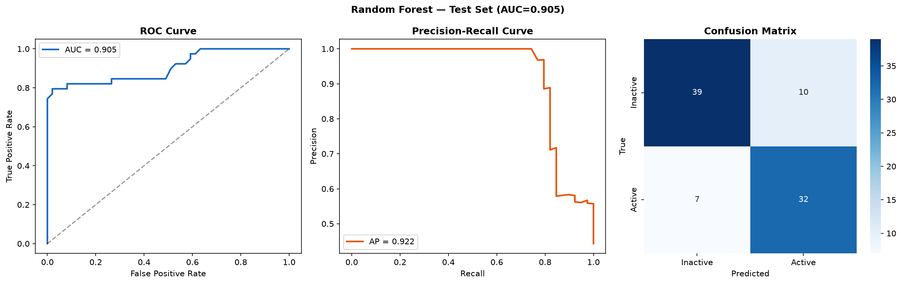
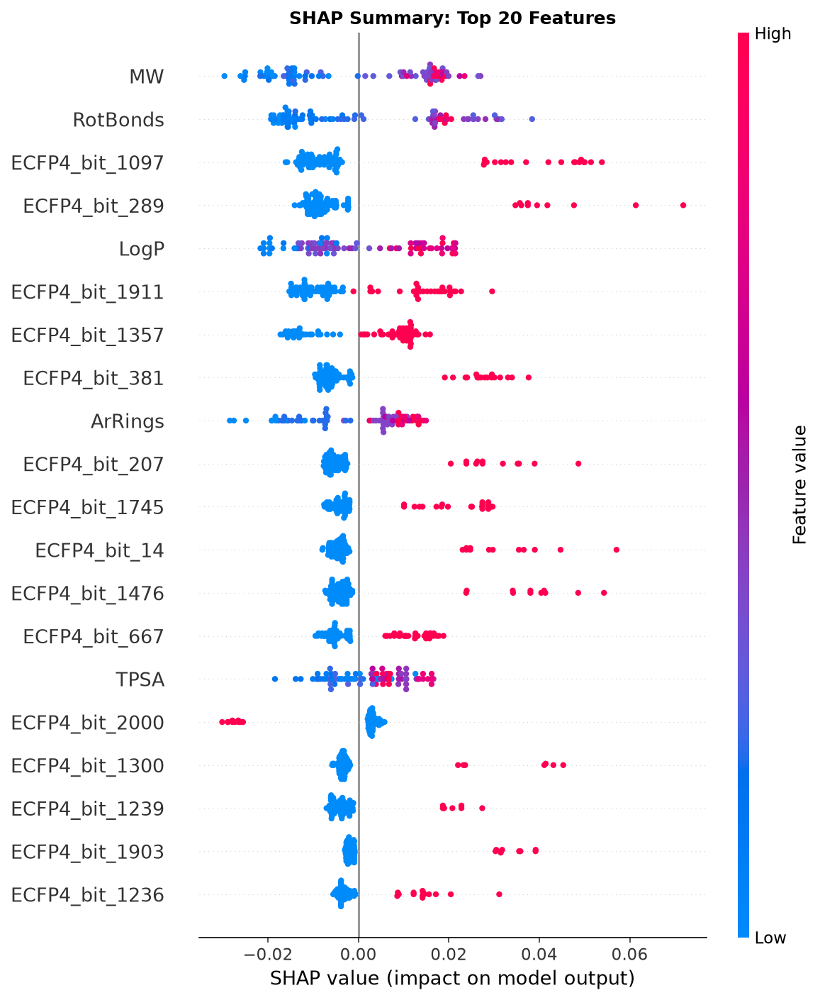

# G-Quadruplex Ligand Bioactivity Classifier

Predicts whether a small molecule stabilizes G-quadruplex (G4) DNA from its structure alone, using ChEMBL assay data and scaffold-aware validation.

## Highlights

- 367 compounds (348 from ChEMBL, 19 literature compounds), described by ECFP4 fingerprints (2048 bits) plus 7 RDKit physicochemical descriptors
- Random forest: scaffold-grouped 5-fold CV AUC **0.940 ± 0.023**; over 20 repeated scaffold splits, AUC **0.937 ± 0.032** and AUPRC **0.947 ± 0.027**
- Single-assay robustness check (ΔTm labels only, 250 compounds): CV AUC 0.915 ± 0.030
- A size-only baseline (molecular weight and rotatable bonds) reaches test AUC 0.66, so most of the signal comes from substructure features
- Train and test sets share no Murcko scaffolds, and oversampling happens inside the cross-validation folds

## Results



Single scaffold split (88 test compounds, 39 active): ROC AUC 0.905, AUPRC 0.922 (a random classifier scores about 0.44). With so few test compounds, one split is noisy, so the repeated-split figures above are the better summary.



SHAP beeswarm plot of the top 20 features. Molecular weight and rotatable bonds are the highest-ranked physicochemical descriptors; most of the other top features are ECFP4 substructure bits.

### Model comparison (scaffold-grouped 5-fold CV, ROC AUC)

| Model | All assays (367 compounds) | ΔTm labels only (250 compounds) |
|---|---|---|
| Logistic Regression | 0.913 ± 0.026 | 0.839 ± 0.054 |
| Random Forest | **0.940 ± 0.023** | **0.915 ± 0.030** |
| XGBoost | 0.903 ± 0.037 | 0.858 ± 0.031 |
| SVM | 0.908 ± 0.035 | 0.888 ± 0.046 |

Size-only baseline (logistic regression on molecular weight and rotatable bonds): test AUC 0.659 on all assays, 0.554 on ΔTm only.

## Why This Project

G-quadruplexes are four-stranded DNA structures found in telomeres and oncogene promoters (c-MYC, KRAS, BCL2). Small molecules that stabilize them are studied as anticancer agents. Experimental screening is expensive, so a model that ranks candidates from SMILES alone can help prioritize compounds. My bench work on G4 ligand binding at Bose Institute (CD spectroscopy, thermal stabilization assays) motivated this project.

## Data and labels

- **ChEMBL exports:** three activity downloads (4,162 records), semicolon-separated, placed in `data/` (see `data/README.md`).
- **Label rules:** ΔTm ≥ 5 °C is active; IC50, Kd or DC50 ≤ 10 µM is active; Ka ≥ 1e5 is active; the "Activity" type is active at ≥ 50, as exported. Records with fragments (salts) are removed.
- **Duplicates:** when records for the same structure disagree on the label, the compound is dropped (228 compounds removed). Earlier versions kept the active label, which biased the dataset toward active compounds.
- **After cleaning:** 348 unique ChEMBL compounds (180 active, 168 inactive). By assay type: ΔTm 231 (149 active), Kd 21 (18), Activity 80 (9), deltaTm1/2 7 (1), Ka 6 (0), DC50 2 (2), IC50 1 (1).
- **Curated compounds (19):** eight widely studied G4-interacting compounds as actives (pyridostatin, BRACO-19, berberine, ellipticine, cryptolepine, quindoline, doxorubicin, mitoxantrone) and eleven common drugs with no reported G4 activity as assumed inactives. SMILES were retrieved from PubChem. The inactive labels are assumptions, not measurements.
- **Final dataset:** 367 compounds, 188 active and 179 inactive.

## Methodology

- **Features:** ECFP4 Morgan fingerprints (2048 bits) plus molecular weight, LogP, TPSA, H-bond donors and acceptors, rotatable bonds and aromatic rings.
- **Split:** Murcko scaffold groups (219 scaffolds). 279 compounds train and 88 test with no scaffold overlap. Cross-validation uses grouped folds on the training set.
- **Imbalance:** SMOTE inside each training fold only, through an imbalanced-learn pipeline.
- **Models:** logistic regression, random forest, XGBoost and SVM. The best model by CV AUC is evaluated on the held-out test set.
- **Repeated evaluation:** 20 random scaffold-grouped splits of the full dataset for a steadier estimate.
- **Interpretability:** SHAP values for the random forest.
- **Switch:** set `DELTA_TM_ONLY = True` in the notebook to run the single-assay analysis.

## Limitations

- Labels combine assay types and thresholds. The ΔTm-only run gives a similar result, which suggests the mixed assays do not drive the performance.
- 40% of ChEMBL compounds had conflicting records and were removed. This includes some compounds that bind G4 selectively over duplex DNA, so selective binders are under-represented.
- Murcko scaffolds are strict. Related compound series with different scaffolds can still appear on both sides of a split.
- The best model was chosen by the same cross-validation that is reported, so the CV AUC is slightly optimistic.
- SHAP shows associations in this dataset. A fingerprint bit can stand for a specific compound series, so these are not evidence of a binding mechanism.
- The curated inactive compounds are assumed negatives.

## Installation and usage

```bash
pip install -r requirements.txt
```

Copy the ChEMBL exports into `data/` and open `g4_ligand_classifier_final.ipynb`. Run all cells from the top. SMILES for the curated compounds are downloaded from PubChem, so the first run needs internet access.

## Author

Agnidipa Sett, M.Tech Bioinformatics, Delhi Technological University
